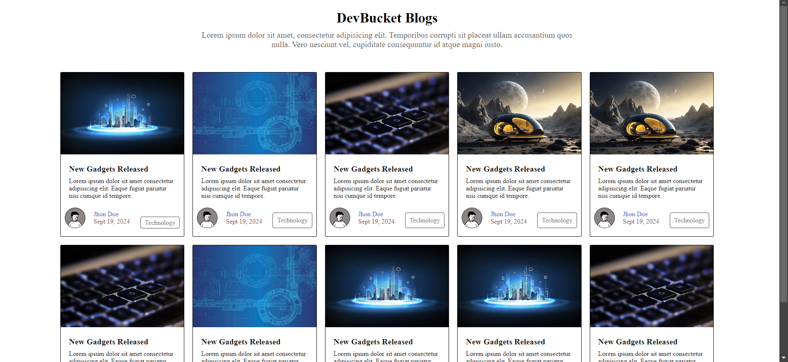

# DevBucket Blogs

DevBucket Blogs is a responsive blog website designed to showcase blog posts with appealing visuals, author details, and categorized tags. The project is built with HTML and CSS, ensuring a clean and organized layout.

## Features
- Responsive design suitable for various devices.
- Lazy loading for images to improve page performance.
- Organized card-based layout for blog entries.
- Dynamic avatars for authors using DiceBear API.
- Placeholder content for further customization.

## Preview



## Project Structure
The project consists of the following main files:

```
📂 Project Directory
├── index.html        # Main HTML file for the blog website
├── style.css         # CSS file for styling
├── image1.jpg        # Example image for a blog card
├── image2.jpg        # Example image for a blog card
├── image3.jpg        # Example image for a blog card
├── image4.jpg        # Example image for a blog card
```

## How to Use
1. Clone or download the project.
2. Open `index.html` in your browser to view the blog website.
3. Customize the `index.html` and `style.css` files to add your own content and styles.
4. Replace `image1.jpg`, `image2.jpg`, `image3.jpg`, and `image4.jpg` with your own images or use online image links.

## Dependencies
- **DiceBear Avatars API**: Generates random avatars for authors.  
  Example URL: `https://api.dicebear.com/7.x/notionists/svg?seed=John?size=64`
- **Unsplash Source API (Optional)**: Can be used for random images by replacing placeholders.  
  Example URL: `https://source.unsplash.com/random/600×400?technology`

## Customization Tips
- Replace the `Lorem ipsum` placeholder text with meaningful blog content.
- Update image paths or URLs in the `` tags to point to your assets.
- Modify `style.css` to apply custom fonts, colors, and layouts.

## Future Enhancements
- Add interactivity using JavaScript (e.g., filters, search functionality).
- Integrate a backend to dynamically fetch blog content.
- Enhance the layout with animations or transitions.

## Credits
- **Author Avatars**: [DiceBear Avatars](https://dicebear.com/)
- **Sample Images**: [Unsplash](https://unsplash.com/)
- **Developer**: [Vishwakarma Abhishek](https://github.com/Abhishek200-1)

Feel free to use and modify this project for personal or educational purposes. If you like it, a star on GitHub would be appreciated!
